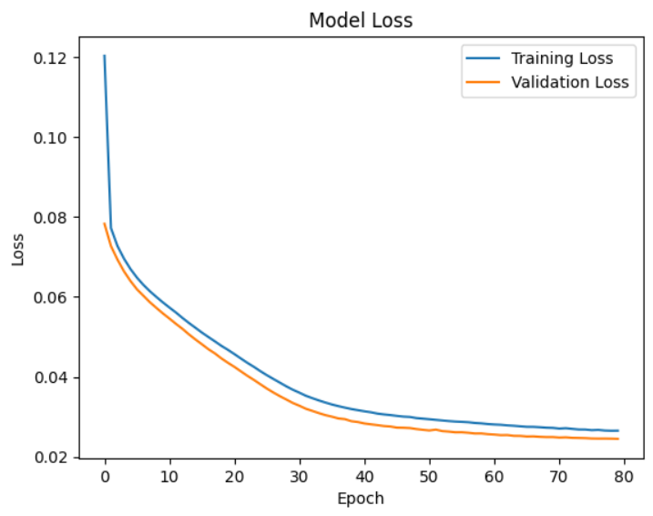

# Deep Q-Network (DQN) Racing Agent

> **A Reinforcement Learning agent capable of mastering high-speed racing circuits via Q-Value approximation and custom reward shaping.**


*Figure 1: Convergence Analysis. Validation loss minimization over 80 epochs. The rapid decay demonstrates the MLP's ability to approximate long-term rewards from immediate sensor states.*

---

## 🧪 Abstract
This research explores the application of **Deep Q-Learning (DQN)** to continuous control problems in autonomous racing. Unlike end-to-end vision approaches, this agent utilizes a highly efficient **Multi-Layer Perceptron (MLP)** architecture processing a low-dimensional sensor vector (LIDAR-style track segments + Telemetry).

The study compares **4 distinct reward architectures** and **3 exploration strategies** to solve the stability-agility trade-off in high-speed cornering.

---

## 🧠 Model Architecture
The "Brain" is a dense neural network optimized for CPU-bound inference (<5ms latency).

* **Input Layer (24-Dim):**
    * 19 Track Edge Sensors (Range-finding)
    * 5 Telemetry Vectors (Speed X/Y/Z, Angle, Track Position)
* **Hidden Layers:** Dense(128, ReLU) $\to$ Dense(63, ReLU) $\to$ Dense(32, ReLU)
* **Output Layer:** Single Q-Value regression for the selected State-Action pair.
* **Optimizer:** Adam ($\alpha = 1e-4$) with Huber Loss for robustness against outliers.

---

## ⚙️ Advanced Techniques
To achieve stable convergence on complex track geometries, I implemented several engineering optimizations beyond standard DQN:

### 1. Biased Epsilon-Greedy Exploration
Standard random exploration wastes training time on physically invalid actions (e.g., "Full Brake + Sharp Left").
* **Solution:** I implemented a **Biased Action Selector** that weights exploration probabilities towards physically viable maneuvers, pruning the action space and accelerating early-stage convergence.

### 2. Logarithmic Sensor Normalization
Raw track sensors return values ranging from 0m to 200m, creating high variance gradients.
* **Solution:** Applied `np.log1p()` scaling to all range-finder inputs, compressing the input space to a normalized range $[0, 1]$ while preserving sensitivity to close-range obstacles (walls).

### 3. Momentum-Based Action Filter
The raw DQN output can exhibit high-frequency oscillation (jitter).
* **Solution:** Integrated a **Momentum Filter** ($k=2$) that clamps the maximum rate of change for steering outputs, simulating real-world actuator constraints and preventing loss of traction.

---

## 📉 Reward Engineering: The "Ablation Study"
The core contribution of this project is the design of a composite reward function (`Reward v4`) that balances longitudinal velocity with lateral stability and cornering safety.

**Code Snippet: Composite Reward Logic**
```python
def calculate_reward(current_state):
    # 1. Forward Progress (The main goal)
    reward = (current_state['distFromStart'] - prev_dist) * 5.0

    # 2. Speed Incentive (Normalized)
    reward += min(current_state['speedX'] / 200.0, 1.0)

    # 3. Dynamic Stability Constraints (High Speed Only)
    if current_state['speedX'] > 10:
        # Penalize being off-center
        reward += (0.2 - abs(current_state['trackpos']) * 0.2)
        # Penalize sharp steering angles to prevent spin-outs
        reward += (0.4 - (abs(current_state['angle']) * 0.4) / 1.57)

    # 4. Corner Entry Safety (Look-Ahead)
    # If the forward sensor (track_9) detects a turn <10m away
    # and speed is >20 m/s, apply penalty to encourage braking.
    if current_state['track_9'] < 10 and current_state['speedX'] > 20:
        reward -= (current_state['speedX'] / 200.0)

    return reward
